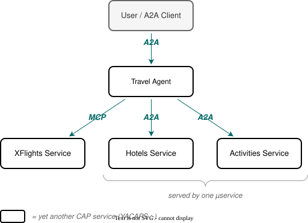

# Travel Sample

Multi-agent travel planner demonstrating agent-to-agent orchestration with MCP tool access. A travel agent coordinates hotel bookings, flight reservations, and local activities by delegating to specialized downstream agents and services.

## Architecture



## Services

| Service             | Port | Protocol | Description                                                                                                                                      |
| ------------------- | ---- | -------- | ------------------------------------------------------------------------------------------------------------------------------------------------ |
| `travel-agent/`     | 4004 | `@agent` | Markdown-based deep agent orchestrator (AGENTS.md + skills/). Delegates to downstream agents and MCP servers; supports file uploads + emissions. |
| `leisure-services/` | 4006 | `@agent` | Agentified CAP services. Exposes `HotelService` and `ActivityService` as autonomous agents with LLM access.                                      |
| `xflights/`         | 4005 | `@mcp`   | Flight master data service. Exposes airlines, airports, flights, and booking actions as MCP tools.                                               |

## Running the Sample

Start all three services in separate terminals:

```bash
# Terminal 1 - Flight data (MCP)
cds watch tests/samples/travel/xflights

# Terminal 2 - Hotel + Activity agents
cds watch tests/samples/travel/leisure-services --profile hybrid

# Terminal 3 - Travel agent orchestrator
cds watch tests/samples/travel/travel-agent
```

The leisure-services can be started in hybrid mode if an AI Core binding is available or the `$AICORE_SERVICE_KEY` environment variable is set. If it is started in development mode, the agents will return a mock response instead of calling an LLM. The travel-agent is always using LLMs, as it has a custom agent implementation. Xflights does not need an LLM to start MCP servers, so the profile does not matter.

Then send a message to the travel agent at `http://localhost:4004/a2a/travel-agent`.

## Key Concepts

- **Markdown-based orchestrator** — `AGENTS.md` for identity, `skills/` for progressive workflow disclosure. The plugin's auto-build path (`createAutoDeepAgent`) wires the deepagents graph; the service handler only contributes external A2A + MCP tools through the `buildTools` event.
- **Agentified CAP services** - Hotels and activities are standard CAP services annotated with `@agent`. They get their own LLM and tools automatically - no custom code needed.
- **Natural-language delegation** - The orchestrator sends descriptive messages to downstream agents. They handle tool selection and execution independently.
- **File I/O** — `cds.agents.fileIO.enabled = true` in the sample's `package.json` enables A2A `FilePart` ingestion + `read_file('/uploads/…')` + `write_file('/outputs/…')` (deepagents backends auto-wired). See `requests.http` request #4 for an end-to-end CSV-to-itinerary scenario.
- **MCP for structured tool access** - Flight data is accessed via MCP tools with structured parameters (query, describe, bookFlight, cancelFlight). The orchestrator calls these directly.
- **Multi-turn conversations** - `CdsCheckpointSaver` (auto-injected) persists LangGraph state, enabling multi-turn conversations across requests (plan first, then book).
- **Parallel tool invocation** - The orchestrator calls multiple downstream agents and MCP tools in parallel when the request spans multiple domains.
