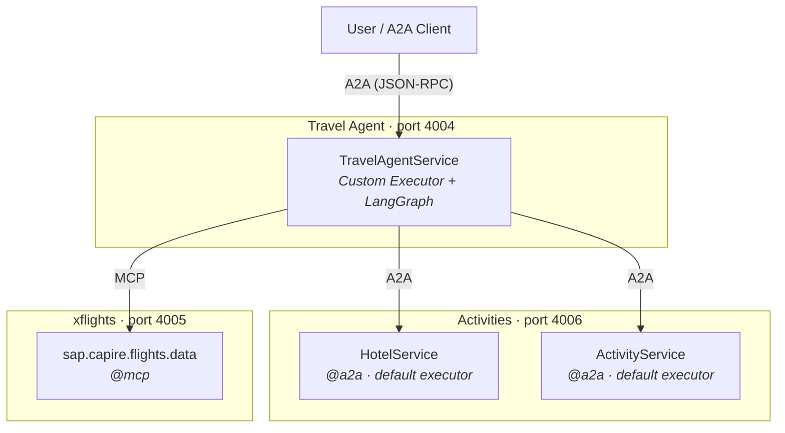
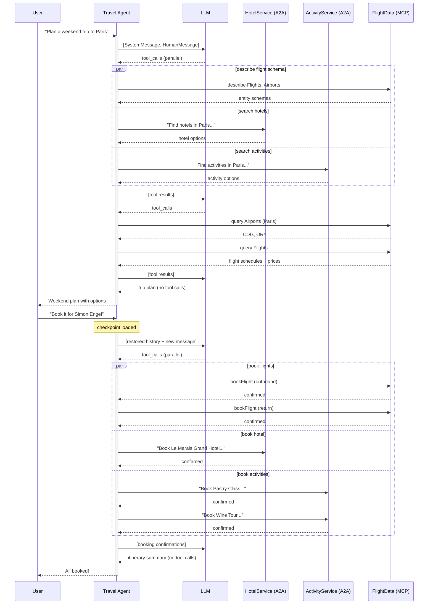

# Travel Sample

Multi-agent travel planner demonstrating A2A orchestration with MCP tool access. A travel agent coordinates hotel bookings, flight reservations, and local activities by delegating to specialized downstream agents and services.

## Architecture



## Services

| Service         | Port | Protocol | Description                                                                                                               |
| --------------- | ---- | -------- | ------------------------------------------------------------------------------------------------------------------------- |
| `travel-agent/` | 4004 | `@a2a`   | Orchestrator with custom executor. Connects to downstream A2A agents and MCP server via LangGraph.                        |
| `activities/`   | 4006 | `@a2a`   | Hotel and activity services with default executor. Exposes `HotelService` and `ActivityService` as autonomous A2A agents. |
| `xflights/`     | 4005 | `@mcp`   | Flight master data service. Exposes airlines, airports, flights, and booking actions as MCP tools.                        |

## Request Flow



## Running the Sample

Start all three services in separate terminals:

```bash
# Terminal 1 — Flight data (MCP)
cds watch tests/travel-sample/xflights

# Terminal 2 — Hotel + Activity agents (A2A)
cds watch tests/travel-sample/activities

# Terminal 3 — Travel agent orchestrator (A2A)
cds watch tests/travel-sample/travel-agent
```

Then send a message to the travel agent via the A2A protocol at `http://localhost:4004/a2a/travel-agent`.

## Key Concepts

- **Custom executor** — The travel agent sets `this.a2a = { executor }` in its service handler, bypassing the default LangGraph executor with a fully custom implementation.
- **A2A for natural-language delegation** — Hotels and activities are autonomous agents with their own LLM. The orchestrator sends them descriptive messages and they handle tool selection and execution independently.
- **MCP for structured tool access** — Flight data is accessed via MCP tools with structured parameters (query, describe, bookFlight, cancelFlight). The orchestrator calls these directly.
- **Multi-turn conversations** — `CdsCheckpointSaver` persists LangGraph state to the database, enabling multi-turn conversations across requests (plan first, then book).
- **Parallel tool invocation** — The orchestrator calls multiple A2A agents and MCP tools in parallel when the request spans multiple domains.
